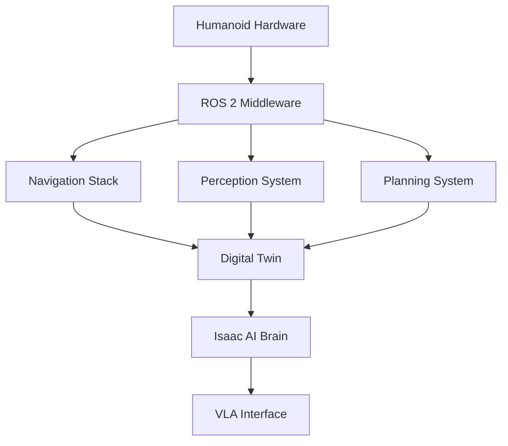

# Chapter 14: Autonomous Humanoid Integration

## Introduction

The capstone chapter brings together all the concepts learned in the previous modules to create a comprehensive autonomous humanoid robot system. This chapter demonstrates how to integrate the ROS 2 nervous system, digital twin capabilities, AI-robot brain, and vision-language-action systems into a cohesive architecture.

## System Architecture

The autonomous humanoid system integrates four core subsystems:

1. **Robotic Nervous System (ROS 2)**: Provides the communication backbone and device abstraction
2. **Digital Twin**: Enables simulation-based testing and validation
3. **AI-Robot Brain (NVIDIA Isaac)**: Handles perception, planning, and decision making
4. **Vision-Language-Action (VLA)**: Provides multimodal interaction capabilities

## Integration Patterns

### 1. Communication Architecture

The system uses a distributed architecture where each subsystem communicates through ROS 2 topics and services:

### 2. Safety and Coordination

All subsystems implement safety protocols and coordination mechanisms:

- **Fail-safe behaviors**: Each subsystem has predefined safe states
- **Priority-based arbitration**: Critical safety behaviors take precedence
- **Graceful degradation**: System continues operation with reduced functionality if subsystems fail

## Implementation Example

### Autonomous Navigation

The integrated system implements autonomous navigation by combining perception, planning, and control:

1. **Perception**: VLA system identifies obstacles and goals
2. **Planning**: Navigation stack computes optimal path
3. **Control**: ROS 2 controllers execute movement commands
4. **Simulation**: Digital twin validates behavior before real-world execution

### Human-Robot Interaction

The system supports natural human-robot interaction through the VLA interface:

1. **Voice Commands**: Processed through speech recognition
2. **Gesture Recognition**: Hand and body pose interpretation
3. **Contextual Understanding**: AI brain interprets intent
4. **Action Execution**: ROS 2 controllers execute appropriate responses

## Validation and Testing

### Simulation-Reality Pipeline

The system follows the Concept → Architecture → Simulation → Deployment pipeline:

1. **Concept**: Define the autonomous behavior
2. **Architecture**: Design the system integration
3. **Simulation**: Validate in digital twin environment
4. **Deployment**: Execute on real humanoid robot

### Performance Metrics

The system is validated against the following metrics:

- **Task Completion Rate**: Percentage of tasks completed successfully
- **Response Time**: Latency between command and execution
- **Safety Compliance**: Percentage of safe behaviors executed
- **Energy Efficiency**: Power consumption during operation

## Challenges and Solutions

### Integration Complexity

**Challenge**: Multiple subsystems with different timing requirements
**Solution**: Use ROS 2's real-time capabilities and time synchronization

### Safety Assurance

**Challenge**: Ensuring safe operation when multiple AI systems interact
**Solution**: Implement hierarchical safety architecture with hard limits

### Real-time Performance

**Challenge**: Meeting real-time requirements across distributed system
**Solution**: Use deterministic scheduling and priority-based execution

## Future Extensions

The architecture supports extensions including:

- Multi-robot coordination
- Learning from demonstration
- Adaptive behavior generation
- Cloud-based intelligence

## Summary

This capstone demonstrates the integration of all textbook concepts into a functional autonomous humanoid system. Students should now understand how to design, implement, and validate complex robotic systems that bridge digital intelligence and physical embodiment.